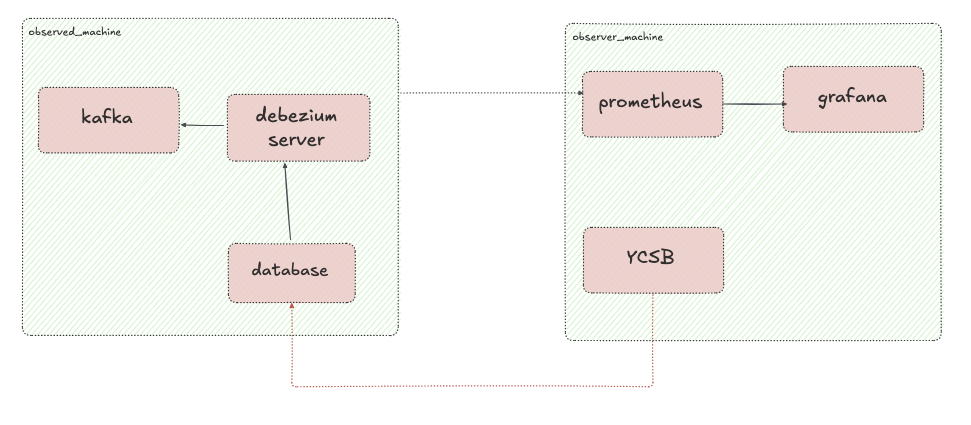
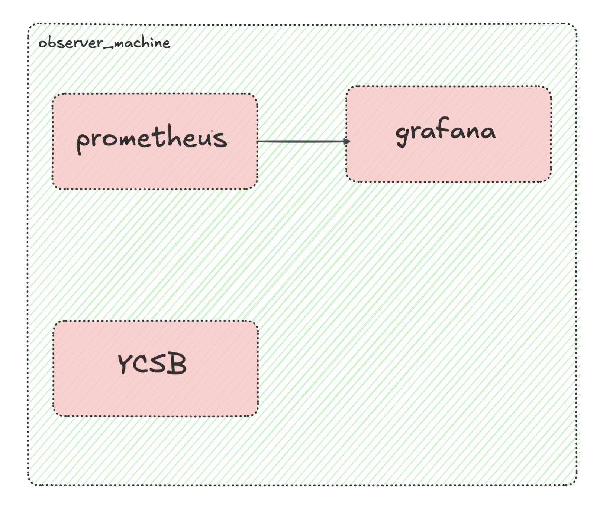
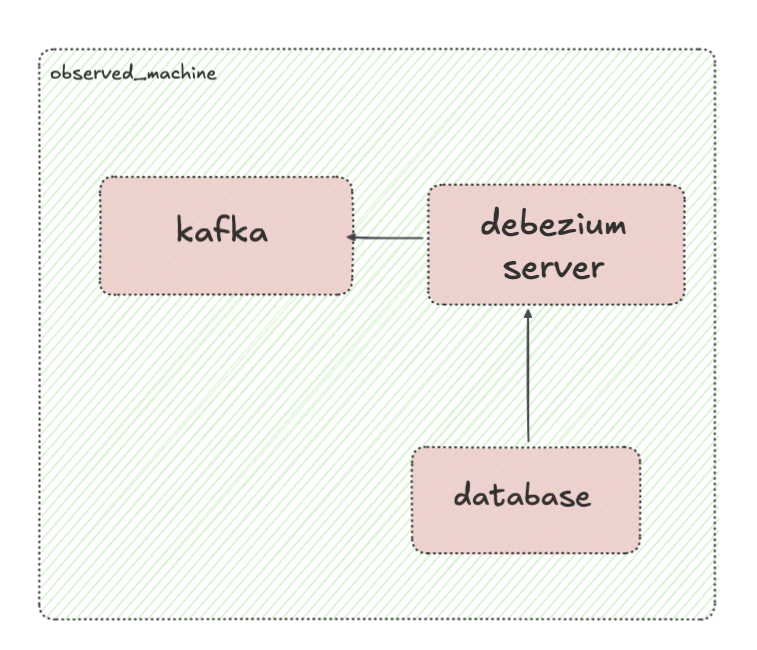

# Debezium Server Performance Testing Framework

A comprehensive, automated framework for performance testing and benchmarking [Debezium Server](https://debezium.io/) deployments. This framework provides infrastructure automation, containerized test environments, workload generation, and real-time monitoring to evaluate Debezium's behavior under various load conditions.

## Overview

This framework implements a distributed testing architecture with two distinct machine:

- **Observer Machine**: Generates database load using YCSB and monitors the observed machine using Prometheus and Grafana
- **Observed Machine**: Runs the services under test (Debezium, Kafka, and databases) in an isolated environment

The framework automates the complete lifecycle from infrastructure provisioning to results visualization, enabling consistent and repeatable performance testing.

## Architecture



The framework uses a two-machine architecture to ensure monitoring and load generation do not interfere with the system under test.

## Architecture Design

The framework separates concerns to ensure accurate measurements:

1. **Isolation**: Observer and observed machines run on separate hardware to prevent resource contention
2. **Containerization**: All services run in containers for consistency and portability
3. **Automation**: Terraform and Ansible eliminate manual configuration errors
4. **Reproducibility**: Versioned configurations and container images ensure repeatable tests

### Observer Machine



- **Monitoring Stack**: Prometheus + Grafana for metrics collection and visualization
- **Load Generation**: YCSB (Yahoo! Cloud Serving Benchmark) for database workload generation
- **Workload Scenarios**: Predefined and custom workload configurations

### Observed Machine



- **Debezium Server**: Change Data Capture engine
- **Apache Kafka**: Event streaming platform
- **Database**: Source database (MySQL, PostgreSQL, etc.)
- **cAdvisor**: Container metrics exporter for Prometheus

## Quick Start

### Prerequisites

- Docker with BuildX support (for building images)
- Terraform >= 1.3 (for infrastructure provisioning)
- Ansible => 2.19
- AWS account with configured credentials (for automated deployment)

### Deployment

Deploy the complete testing environment to AWS:

```bash
cd debezium_server/infrastructure_automation
terraform init
terraform apply
```

Terraform will provision both machines, install all dependencies, and output:
- Public IPs for both machines
- Grafana credentials and URL
- SSH connection details

### Access Monitoring

After deployment, access Grafana at:
```
http://<observer-machine-ip>:3000
```

Default credentials are provided in the Terraform output or monitoring  configuration. They can be changed in [this file](./observer_machine/monitoring/.env)

## Workload Configuration

Workloads are defined using YCSB workload files with configurable parameters:

- **Read/Write ratios**: Simulate different workload patterns
- **Record counts**: Scale data volume
- **Operation distribution**: INSERT, UPDATE, READ mix
- **Throughput targets**: Control load intensity

See [`debezium_server/observer_machine/scenarios/workloads/`](observer_machine/scenarios/workloads/) for examples. 
For mor information on how to configure a workload, you can always check [YCSB Wiki](https://github.com/brianfrankcooper/YCSB/wiki/Running-a-Workload).
